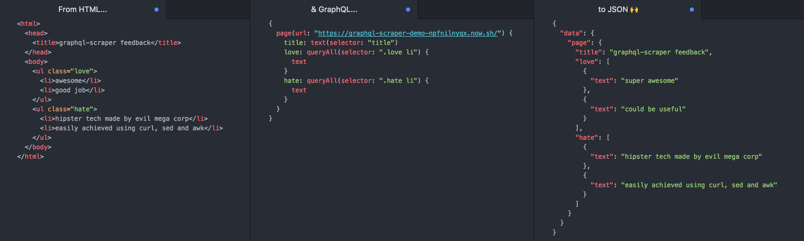

# graphql-scraper



[GraphQL](http://graphql.org/) lets us query all sorts of graph-shaped data - so why not use it to query the world's most useful graph, **the web**?

`graphql-scraper` is a command-line tool and reusable GraphQL schema which lets you easily extract data from HTML.

## Install

```
npm install -g graphql-scraper
```

## The command-line tool

```
graphql-scraper <query-file>
```

Reads a GraphQL query from the path `query-file`, and prints the result.

If `query-file` is not given, reads the query from stdin.

### Command-line options

- `--json` Returns the result in JSON format, for use in other tools.
- `--help` Prints a help string.


### Variables

Any other named options you pass to the CLI will be used as a [query variable](http://graphql.org/learn/queries/#variables).

For example, if you want to reuse the same query on several pages, you could write the following query file (`query.graphql`):

```graphql
query ExampleQueryWithVariable($page: String) {
  page(url: $page) {
    items: queryAll(selector: "tr.athing") {
      rank: text(selector: "td span.rank")
      title: text(selector: "td.title a")
      sitebit: text(selector: "span.comhead a")
      url: attr(selector: "td.title a", name: "href")
      attrs: next {
        score: text(selector: "span.score")
        user: text(selector: "a:first-of-type")
        comments: text(selector: "a:nth-of-type(3)")
      }
    }
  }
}
```

...and execute the query like this:

```bash
graphql-scraper query.graphql --page="https://news.ycombinator.com/"
```

## The schema

You can check out an [auto-generated schema description here](doc/schema.md), but I recommend spinning up a [graphql-scraper-web](https://github.com/lachenmayer/graphql-scraper-web) instance and exploring the types interactively.

## Re-using the schema in your own projects

The npm package exports the GraphQL schema which is used by the command-line tool. This an instance of graphql-js [`GraphQLSchema`](http://graphql.org/graphql-js/type/#graphqlschema), which you can use anywhere that expects a schema, for example [`apollo-server`](https://www.apollographql.com/docs/apollo-server/) or [`graphql-yoga`](https://github.com/graphcool/graphql-yoga).

Use `npm install graphql-scraper` or `yarn add graphql-scraper` to add the schema to your project.

### Basic example with `graphql`

```js
import { graphql } from 'graphql'
import schema from 'graphql-scraper'
// You can also import it as follows:
// const schema = require('graphql-scraper')


const query = `
{
  page(url: "http://news.ycombinator.com") {
    items: queryAll(selector: "tr.athing") {
      rank: text(selector: "td span.rank")
      title: text(selector: "td.title a")
      sitebit: text(selector: "span.comhead a")
      url: attr(selector: "td.title a", name: "href")
      attrs: next {
        score: text(selector: "span.score")
        user: text(selector: "a:first-of-type")
        comments: text(selector: "a:nth-of-type(3)")
      }
    }
  }
}
`

graphql(schema, query).then(response => {
  console.log(response)
})
```

## Background

This project was inspired by [`gdom`](https://github.com/syrusakbary/gdom), which is written in Python and uses the [Graphene](http://graphene-python.org/) GraphQL library.

If you want to switch over from `gdom`, please note some schema changes:

- `query(selector: String!)` now only returns a single `Element`, rather than a list (like `document.querySelector`). Added a new `queryAll(selector: String!): [Element]` field, which behaves like `document.querySelectorAll`.
- `is(selector: String!)` is renamed to `has(selector: String!)`.
- `children`, `parent`, `siblings`, `next` etc. no longer have a `selector` argument. If you need to select children with a specific selector, use [child selectors](https://developer.mozilla.org/en-US/docs/Web/CSS/Child_selectors) (`.foo > .bar`).
- `parents` is removed.
- `prev[All]` is renamed to `previous[All]`.

## Maintainers

[@lachenmayer](https://github.com/lachenmayer)

## Contribute

PRs accepted.

## License

MIT © 2018 harry lachenmayer
